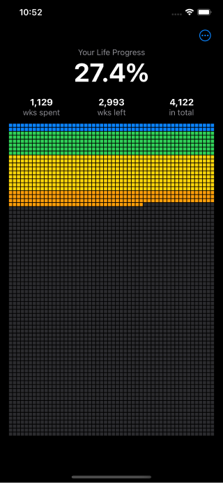
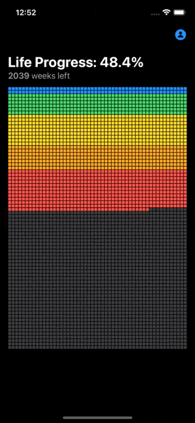
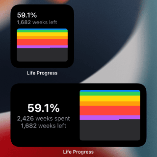

# Life Progress
> Friendly reminder that you're not gonna live forever

# How it works
- Each row represents a year of your life.
- Each square represents a week. The one at the top left is the week you were born.
- The colored squares are the weeks in the past, the gray ones are what you have left.

 

The app also comes with widgets so you can see your life progress at a glance.

# Thanks
- [Ken Wheeler](https://twitter.com/ken_wheeler) for the [app idea](https://twitter.com/tienphaw/status/1533797664432615424)
- [Tim Urban](https://twitter.com/waitbutwhy) for inventing the concept of the life calendar and presenting it in [this article](https://waitbutwhy.com/2014/05/life-weeks.html)