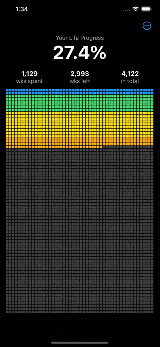
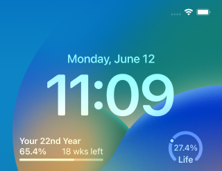

# Life Progress

> Friendly reminder that you're not gonna live forever

# Download

# How it works

- Each square you see on screen represents a week in your life. The first square (the one at the top left) is the week you were born.
- Each row of 52 weeks makes up one year
- The colored squares are the weeks in the past, the gray ones are what you have left.

 

The app also comes with widgets so you can see your life progress at a glance.

# Thanks

- [Ken Wheeler](https://twitter.com/ken_wheeler) for the [app idea](https://twitter.com/tienphaw/status/1533797664432615424)
- [Tim Urban](https://twitter.com/waitbutwhy) for introducing us to the concept of the life calendar in [this article](https://waitbutwhy.com/2014/05/life-weeks.html)
